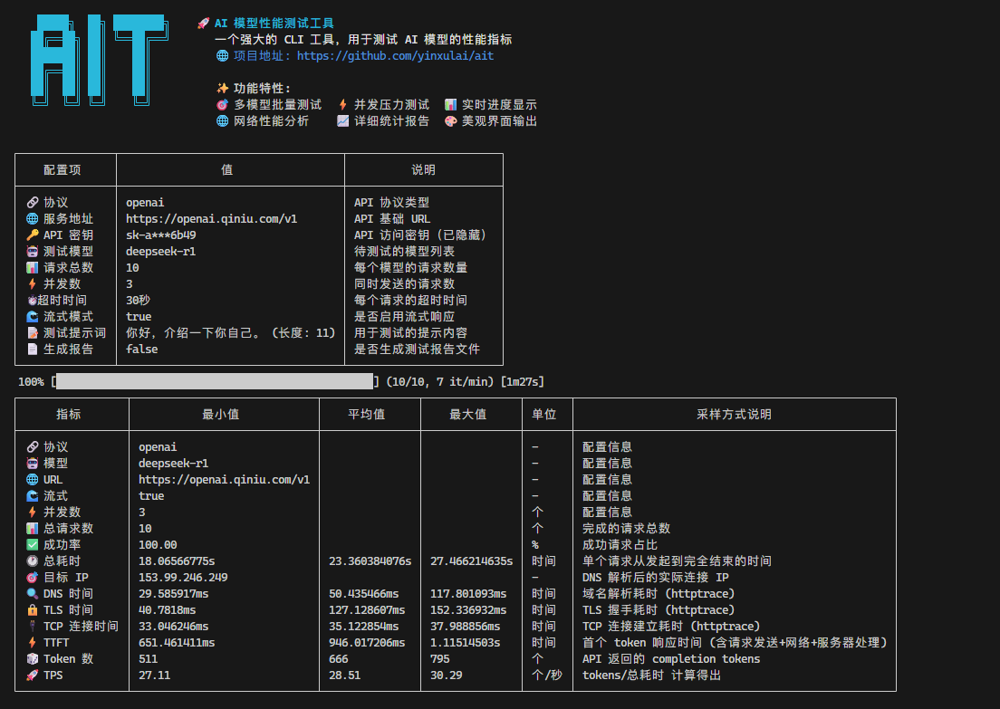

# AIT - AI 模型性能测试工具

[](https://github.com/yinxulai/ait/actions/workflows/test.yaml)
[](https://codecov.io/gh/yinxulai/ait)

一个强大的 CLI 工具，用于批量测试符合 OpenAI 协议和 Anthropic 协议的 AI 模型性能指标。支持 TTFT（首字节时间）、TPS（吞吐量）、网络延迟等关键性能指标的测量，提供多模型对比测试和详细的性能报告生成功能。

## ✨ 功能特性

- 🚀 **多协议支持**: 支持 OpenAI 和 Anthropic 协议
- 🎯 **多模型测试**: 支持同时测试多个模型，用逗号分割模型名称
- 🤖 **智能协议推断**: 根据环境变量自动推断协议类型，简化使用
- 📊 **实时进度条**: 测试过程可视化显示，支持多模型总进度
- 🎨 **彩色输出**: 美观的终端界面
- 📋 **表格化结果**: 清晰的结果展示，支持单模型和多模型对比
- ⚡ **并发测试**: 支持自定义并发数压力测试
- ⏱️ **超时控制**: 可配置请求超时时间，提高测试稳定性
- 📈 **详细统计**: TTFT、TPS、最小/最大/平均响应时间
- 📄 **多格式报告**: 支持生成 JSON 和 CSV 格式的详细测试报告
- 🌐 **网络指标**: 包含 DNS、连接、TLS 握手等网络性能指标
- 🔄 **流式支持**: 默认支持流式响应，更真实的测试场景



## 🛠️ 安装和使用

### 方式一：下载预编译二进制文件（推荐）

从 [Releases 页面](https://github.com/yinxulai/ait/releases) 下载适合您平台的预编译二进制文件：

```bash
# Linux (x64)
wget https://github.com/yinxulai/ait/releases/latest/download/ait-linux-amd64
chmod +x ait-linux-amd64
sudo mv ait-linux-amd64 /usr/local/bin/ait

# Linux (ARM64)
wget https://github.com/yinxulai/ait/releases/latest/download/ait-linux-arm64
chmod +x ait-linux-arm64
sudo mv ait-linux-arm64 /usr/local/bin/ait

# macOS (Intel)
wget https://github.com/yinxulai/ait/releases/latest/download/ait-darwin-amd64
chmod +x ait-darwin-amd64
sudo mv ait-darwin-amd64 /usr/local/bin/ait

# macOS (Apple Silicon)
wget https://github.com/yinxulai/ait/releases/latest/download/ait-darwin-arm64
chmod +x ait-darwin-arm64
sudo mv ait-darwin-arm64 /usr/local/bin/ait

# Windows (x64) - PowerShell
Invoke-WebRequest -Uri "https://github.com/yinxulai/ait/releases/latest/download/ait-windows-amd64.exe" -OutFile "ait.exe"
# 将 ait.exe 移动到您的 PATH 中

# Windows (ARM64) - PowerShell
Invoke-WebRequest -Uri "https://github.com/yinxulai/ait/releases/latest/download/ait-windows-arm64.exe" -OutFile "ait.exe"
# 将 ait.exe 移动到您的 PATH 中
```

### 方式二：从源码编译

```bash
# 克隆项目
git clone https://github.com/yinxulai/ait.git
cd ait

# 编译
make build

# 或者直接用 go build
go build -o bin/ait ./cmd/
```

## 🚀 快速开始

### OpenAI 协议测试

```bash
ait 
  --protocol=openai 
  --baseUrl=https://api.openai.com/v1 
  --apiKey=sk-your-api-key 
  --models=gpt-3.5-turbo 
  --concurrency=3 
  --count=10
  --report
```

### Anthropic 协议测试

```bash
ait 
  --protocol=anthropic 
  --baseUrl=https://api.anthropic.com 
  --apiKey=sk-ant-your-api-key 
  --models=claude-3-haiku-20240307 
  --concurrency=2 
  --count=5
  --report
```

### 多模型比较测试

```bash
# 同时测试多个 OpenAI 模型
ait 
  --protocol=openai 
  --baseUrl=https://api.openai.com/v1 
  --apiKey=sk-your-api-key 
  --models="gpt-3.5-turbo,gpt-4,gpt-4-turbo" 
  --concurrency=3 
  --count=10
  --report

# 测试最新的 Claude 和 Gemini 模型
ait 
  --models=claude-4.1-opus,claude-4.0-sonnet,claude-3.5-haiku,gemini-2.5-pro,gemini-2.0-flash 
  --concurrency=3 
  --count=5
  --report

# 多模型测试会为每个模型生成独立的 JSON 和 CSV 报告
# 同时还会生成一个综合比较的 CSV 报告方便对比分析
```

### 本地模型测试（如 Ollama）

```bash
ait 
  --protocol=openai 
  --baseUrl=http://localhost:11434/v1 
  --apiKey=dummy 
  --models=llama2 
  --concurrency=1 
  --count=3
```

## 🔧 环境变量支持

为了简化使用，AIT 支持通过环境变量自动配置 API 密钥和服务地址：

### OpenAI 协议

```bash
export OPENAI_API_KEY="sk-your-api-key"
export OPENAI_BASE_URL="https://api.openai.com/v1"

# 简化使用，protocol 会自动推断为 openai
ait --models=gpt-3.5-turbo --count=10 --report
```

### Anthropic 协议

```bash
export ANTHROPIC_API_KEY="sk-ant-your-api-key"
export ANTHROPIC_BASE_URL="https://api.anthropic.com"

# 简化使用，protocol 会自动推断为 anthropic
ait --models=claude-3-haiku-20240307 --count=5 --report
```

## 📝 管道输入支持

AIT 支持通过管道（pipe）方式输入测试提示语，这对于测试复杂的多行 prompt 或从文件读取内容非常有用。

**优先级规则**：

1. **用户明确指定的 `--prompt` 参数**（最高优先级）
2. **管道输入**（中等优先级，仅当未使用 `--prompt` 参数时生效）
3. **默认值**（最低优先级）

### 基本管道输入

```bash
# 直接通过管道输入（未使用 --prompt 参数时生效）
echo "请分析这段代码的性能优化建议" | ait --models=gpt-4 --count=3

# 从文件输入
cat complex_prompt.txt | ait --models=claude-3-sonnet --count=5

# 用户明确使用 --prompt 参数时，管道输入不会生效（无论内容是否为默认值）
echo "这个不会生效" | ait --models=gpt-3.5-turbo --prompt="用户明确指定"
echo "这个也不会生效" | ait --models=gpt-3.5-turbo --prompt="你好，介绍一下你自己。"
```

### 多行 prompt 测试

```bash
# 创建复杂的测试 prompt
cat << EOF | ait --models=gpt-4,claude-3-sonnet --count=3 --report
请分析以下代码，并提供：
1. 性能优化建议
2. 安全性评估  
3. 可读性改进
4. 最佳实践建议

\`\`\`python
def process_data(data):
    result = []
    for item in data:
        if item > 0:
            result.append(item * 2)
    return result
\`\`\`
EOF
```

## 📋 命令行参数

| 参数            | 描述                                                          | 默认值                    | 必填 |
|:---------------|:-------------------------------------------------------------|:--------------------------|:----:|
| `--protocol`   | 协议类型 (`openai`/`anthropic`)                               | 根据环境变量自动推断        |  ❌  |
| `--baseUrl`    | 服务地址<br/>支持环境变量：`OPENAI_BASE_URL` 或 `ANTHROPIC_BASE_URL` | -                         |  ✅  |
| `--apiKey`     | API 密钥<br/>支持环境变量：`OPENAI_API_KEY` 或 `ANTHROPIC_API_KEY`  | -                         |  ✅  |
| `--models`     | 模型名称，支持多个模型用逗号分割<br/>如：`gpt-4,claude-3-sonnet`     | -                         |  ✅  |
| `--concurrency`| 并发数                                                        | `3`                       |  ❌  |
| `--count`      | 请求总数                                                       | `10`                      |  ❌  |
| `--timeout`    | 请求超时时间（秒）                                              | `30`                      |  ❌  |
| `--prompt`     | 测试提示语<br/>**支持管道输入**：当未使用此参数时，可通过管道输入内容 | `"你好，介绍一下你自己。"`     |  ❌  |
| `--stream`     | 是否开启流模式                                                 | `true`                    |  ❌  |
| `--report`     | 是否生成报告文件（同时生成 JSON 和 CSV）                           | `false`                   |  ❌  |

## 📊 输出指标说明

### 终端输出指标

- **TTFT (Time To First Token)**: 首字节时间，衡量模型开始响应的速度
- **TPS (Tokens Per Second)**: 每秒处理的请求数，衡量系统吞吐量
- **平均/最小/最大响应时间**: 请求的响应时间统计
- **网络性能指标**: DNS 解析、TCP 连接、TLS 握手时间

### 报告文件生成

当使用 `--report` 参数时，将在当前目录生成多种格式的报告文件：

#### 单模型测试

- **JSON 报告**: `ait-report-{模型名}-{时间戳}.json` - 详细的结构化数据
- **CSV 报告**: `ait-report-{模型名}-{时间戳}.csv` - 表格格式，便于导入 Excel 分析

#### 多模型测试

- **每个模型的独立报告**: JSON 和 CSV 格式各一份
- **综合比较报告**: `ait-comparison-{时间戳}.csv` - 包含所有模型的比较数据

#### 报告内容包含

**JSON 报告文件结构:**

- **metadata**: 测试元数据（时间戳、协议、模型名称、配置信息等）
- **time_metrics**: 时间性能指标（平均、最小、最大响应时间）
- **network_metrics**: 网络性能指标（DNS、TCP连接、TLS握手时间，目标IP）
- **content_metrics**: 服务性能指标（TTFT、Token统计、TPS等）
- **reliability_metrics**: 可靠性指标（成功率、错误率）

**CSV 报告文件格式:**

- 扁平化的数据结构，便于导入 Excel 或其他数据分析工具
- 包含所有性能指标的数值化数据
- 支持多模型对比分析和图表生成

**多模型报告特性:**

- 每个模型生成独立的 JSON 和 CSV 报告
- 额外生成综合对比 CSV 文件，包含所有模型的关键指标
- 文件命名格式：`ait-report-{timestamp}.{format}` 或 `ait-report-{model}-{timestamp}.{format}`

## 🎯 使用场景

- **模型性能基准测试**: 评估不同模型的响应速度和质量
- **多模型比较测试**: 同时测试多个模型并生成比较报告
- **服务压力测试**: 测试服务在不同并发下的表现
- **API 接口验证**: 验证 OpenAI 兼容接口的正确性
- **性能监控**: 定期监控模型服务的性能表现
- **容量规划**: 为生产环境部署提供性能数据支持
- **自动化测试**: 结合 CI/CD 流程进行自动化性能测试
- **性能报告**: 生成详细的 JSON 和 CSV 报告用于数据分析和存档

## 📝 使用示例

### 最新模型测试

```bash
# 测试最新的 Claude 4.x 系列模型
ait --models=claude-4.1-opus,claude-4.0-sonnet,claude-4.0-opus --count=5 --report

# 测试最新的 Gemini 2.x 系列模型
ait --models=gemini-2.5-pro,gemini-2.5-flash,gemini-2.0-flash --count=5 --report

# 测试 Claude 3.x 系列模型
ait --models=claude-3.7-sonnet,claude-3.5-haiku --count=5 --report
```

## 🔧 开发和贡献

### 可用命令

```bash
make build          # 编译二进制文件
make test           # 运行测试
make clean          # 清理构建文件
make tidy           # 格式化代码并整理模块依赖
make help           # 查看所有命令
```

### 测试覆盖率

项目已集成 codecov 测试覆盖率上报，每次 push 和 pull request 都会自动运行测试并上报覆盖率数据。

## 📄 许可证

MIT License

## 🤝 贡献

欢迎提交 Issue 和 Pull Request！
