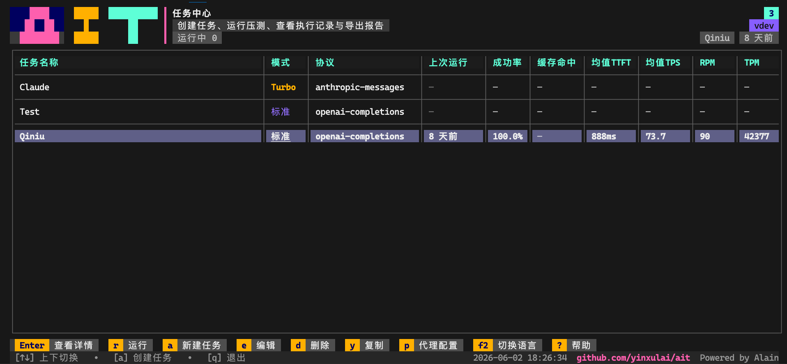

# AIT - AI 模型性能测试工具

[](https://github.com/yinxulai/ait/actions/workflows/test.yaml)
[](https://codecov.io/gh/yinxulai/ait)

一个强大的 CLI 工具，用于批量测试符合 OpenAI 协议和 Anthropic 协议的 AI 模型性能指标。当前版本仅提供 `ait` 命令，不再发布独立的 `tpg` 二进制。新版默认启动交互式终端任务中心（TUI），可在界面内创建、运行和管理测试任务；也支持带参数直接执行单次测试任务。支持 TTFT（首字节时间）、TPS（吞吐量）、网络延迟等关键性能指标的测量，提供多模型对比测试和详细的性能报告生成功能。

## ✨ 功能特性

- 🚀 **多协议支持**: 支持 OpenAI 和 Anthropic 协议
- 🎯 **多模型测试**: 支持同时测试多个模型，用逗号分割模型名称
- 🤖 **智能协议推断**: 根据环境变量自动推断协议类型，简化使用
- 🖥️ **交互式终端 TUI**: `ait` 不带参数启动任务中心，可在终端内创建、运行和管理测试任务；带参数时仍支持直接执行单次任务
- 🧠 **内置 Prompt 输入方案**: 支持 `--prompt-length`、`--prompt-file`、`--prompt` 以及管道输入，直接在 `ait` 内生成和加载测试内容
- 📊 **实时进度条**: 测试过程可视化显示，支持多模型总进度
- 🎨 **彩色输出**: 美观的终端界面
- 📋 **表格化结果**: 清晰的结果展示，支持单模型和多模型对比
- ⚡ **并发测试**: 支持自定义并发数压力测试
- ⏱️ **超时控制**: 可配置请求超时时间，提高测试稳定性
- 📈 **详细统计**: TTFT、TPS、最小/最大/平均响应时间
- 📄 **多格式报告**: 支持生成 JSON 和 CSV 格式的详细测试报告
- 🌐 **网络指标**: 包含 DNS、连接、TLS 握手等网络性能指标
- 🔄 **流式支持**: 默认支持流式响应，更真实的测试场景



## 🛠️ 安装和使用

### 方式一：下载预编译二进制文件（推荐）

从 [Releases 页面](https://github.com/yinxulai/ait/releases) 下载适合您平台的预编译二进制文件。

#### Linux/macOS 一键安装脚本

```bash
curl -fsSL https://raw.githubusercontent.com/yinxulai/ait/main/scripts/install-ait.sh | bash
```

> 脚本会自动识别操作系统（Linux/macOS）和架构（`x86_64`, `aarch64`, `armv7l`, `i386`），下载最新版本并安装到 `/usr/local/bin`。如需自定义安装目录，可使用 `INSTALL_DIR` 环境变量：
> ```bash
> curl -fsSL https://raw.githubusercontent.com/yinxulai/ait/main/scripts/install-ait.sh -o install-ait.sh
> INSTALL_DIR=$HOME/.local/bin bash install-ait.sh
> ```

#### Windows 安装

```powershell
# PowerShell - 下载最新版本（x64）
Invoke-WebRequest -Uri "https://github.com/yinxulai/ait/releases/latest/download/ait-windows-amd64.exe" -OutFile "ait.exe"
# 将 ait.exe 移动到您的 PATH 中（例如 C:\Windows\System32）
```

> 其他架构（ARM64、386）请访问 [Releases 页面](https://github.com/yinxulai/ait/releases) 选择对应的版本下载。

### 方式二：从源码编译

```bash
# 克隆项目
git clone https://github.com/yinxulai/ait.git
cd ait

# 编译（默认版本为 dev）
make build

# 或者指定版本号编译
make build VERSION=v1.0.0

# 直接用 go build
go build -o bin/ait ./cmd/ait/

# 查看版本信息
./bin/ait --version
```

## 🚀 快速开始

### 启动交互式任务中心

```bash
# 直接运行 ait，进入交互式终端任务中心
ait
```

### 以 MCP 服务方式运行（供 AI 调用）

AIT 通过 `--mcp` 启动 MCP 服务，可将现有任务能力（创建任务、启动运行、查询状态）通过 MCP `tools` 暴露给 AI 客户端。

```bash
# 通过 stdio 启动 MCP server（供支持 MCP 的客户端接入）
ait --mcp
```

当前内置工具：

- `ait.list_tasks`
- `ait.create_task`
- `ait.start_run`
- `ait.get_run_state`

### 查看版本信息

```bash
# 查看完整版本信息
ait --version

# 输出示例：
# ait version v1.0.0
# Git Commit: 5ad79fb
# Build Time: 2025-12-08_10:30:15
```

### 运行模式

```bash
# 默认：交互式任务中心（TUI）
ait

# MCP 模式（供 AI 客户端通过 stdio 调用）
ait --mcp
```

> 注意：AIT 已不再提供“通过 --model/--models 等参数直接执行任务”的命令行模式。
> 测试任务请在 TUI 中创建，或通过 MCP 工具 `ait.create_task` 创建。

## 🔧 环境变量支持

为了简化使用，AIT 支持通过环境变量自动配置 API 密钥和服务地址：

### OpenAI 协议

```bash
export OPENAI_API_KEY="sk-your-api-key"
export OPENAI_BASE_URL="https://api.openai.com/v1"

# 在 TUI 创建任务时可复用这些环境变量
ait
```

### Anthropic 协议

```bash
export ANTHROPIC_API_KEY="sk-ant-your-api-key"
export ANTHROPIC_BASE_URL="https://api.anthropic.com"

# 在 TUI 创建任务时可复用这些环境变量
ait
```

## 📝 管道输入和文件支持

AIT 提供了灵活的 prompt 输入方式，满足不同的测试需求：

### 输入方式优先级

1. **用户明确指定的 `--prompt-length` 参数**（最高优先级，用于快速生成指定长度的测试内容）
2. **用户明确指定的 `--prompt-file` 参数**（高优先级）
3. **用户明确指定的 `--prompt` 参数**（中高优先级）
4. **管道输入**（中等优先级，仅当未使用上述参数时生效）
5. **默认值**（最低优先级）

### 1. 快速生成指定长度的测试内容

使用 `--prompt-length` 参数可以快速生成指定字符长度的测试 prompt，无需准备测试文件：

```bash
# 生成 100 个字符的测试内容
ait --models=gpt-4 --prompt-length=100 --count=5

# 生成 1000 个字符的测试内容进行压力测试
ait --models=gpt-4,claude-3-sonnet --prompt-length=1000 --count=20 --concurrency=5 --report

# 测试不同长度的性能表现
ait --models=gpt-4 --prompt-length=500 --count=10 --report
ait --models=gpt-4 --prompt-length=2000 --count=10 --report
```

> **提示**：生成的内容是有意义的中文文本片段，而不是随机字符，更接近真实使用场景。

### 2. 直接字符串输入

```bash
# 直接指定 prompt 内容
ait --models=gpt-4 --prompt="分析人工智能的发展前景" --count=3
```

### 3. 从文件读取 prompt

使用 `--prompt-file` 参数指定文件路径，支持单文件和通配符：

```bash
# 单个文件
ait --models=gpt-4 --prompt-file=prompts/complex_prompt.txt --count=5

# 通配符匹配多个文件（随机选择）
ait --models=gpt-4 --prompt-file="prompts/*.txt" --count=10

# 指定模式的文件
ait --models=claude-3-sonnet --prompt-file="test_cases/scenario_*.txt" --count=5
```

### 4. 管道输入

当未使用 `--prompt`、`--prompt-file` 或 `--prompt-length` 参数时，支持通过管道输入：

```bash
# 基本管道输入
echo "请分析这段代码的性能优化建议" | ait --models=gpt-4 --count=3

# 从文件输入
cat complex_prompt.txt | ait --models=claude-3-sonnet --count=5

# 多行复杂 prompt
cat << EOF | ait --models=gpt-4,claude-3-sonnet --count=3 --report
请分析以下代码，并提供：
1. 性能优化建议
2. 安全性评估  
3. 可读性改进
4. 最佳实践建议

\`\`\`python
def process_data(data):
    result = []
    for item in data:
        if item > 0:
            result.append(item * 2)
    return result
\`\`\`
EOF
```

### 5. 参数组合使用

```bash
# prompt-length 优先级最高，用于快速测试
ait --models=gpt-4 --prompt-length=500 --count=10 --report

# 使用文件输入（优先级：prompt-length > prompt-file > prompt > 管道）
ait --models=gpt-4 --prompt-file="prompts/*.txt" --count=5 --report

# 结合环境变量使用
export OPENAI_API_KEY="sk-your-key"
ait --models=gpt-4,claude-3-sonnet --prompt-file="test_cases/*.txt" --count=10
```

### 6. 批量测试场景

```bash
# 创建多个测试场景文件
mkdir -p test_prompts
echo "请解释机器学习的基本概念" > test_prompts/ml_basic.txt
echo "分析深度学习的应用场景" > test_prompts/dl_applications.txt
echo "比较不同优化算法的特点" > test_prompts/optimization.txt

# 使用通配符随机测试多个场景
ait --models=gpt-4,claude-3-sonnet --prompt-file="test_prompts/*.txt" --count=20 --report
```

### 重要说明

- **参数优先级**：`--prompt-length` > `--prompt-file` > `--prompt` > 管道输入 > 默认值
- **快速测试**：使用 `--prompt-length` 可以快速生成指定长度的测试内容，无需准备文件
- **文件随机选择**：使用通配符时，每次请求会随机选择匹配的文件
- **错误处理**：文件不存在或读取失败时会显示警告并使用默认 prompt

## 📋 命令行参数

| 参数 | 描述 | 默认值 | 必填 |
| :--- | :--- | :--- | :---: |
| `--version` | 显示版本信息（包括 Git Commit 和构建时间） | - | ❌ |
| `--protocol` | 协议类型 (`openai`/`anthropic`) | 根据环境变量自动推断 | ❌ |
| `--baseUrl` | 服务地址<br/>支持环境变量：`OPENAI_BASE_URL` 或 `ANTHROPIC_BASE_URL` | - | ✅ |
| `--apiKey` | API 密钥<br/>支持环境变量：`OPENAI_API_KEY` 或 `ANTHROPIC_API_KEY` | - | ✅ |
| `--model` | 单个模型名称<br/>如：`gpt-4`（不支持多个模型） | - | ❌ |
| `--models` | 模型名称，支持多个模型用逗号分割<br/>如：`gpt-4,claude-3-sonnet` | - | ✅ |
| `--concurrency` | 并发数 | `3` | ❌ |
| `--count` | 请求总数 | `10` | ❌ |
| `--timeout` | 请求超时时间（秒） | `300` | ❌ |
| `--prompt` | 测试提示语（直接输入字符串）<br/>如：`"分析人工智能的发展前景"` | `"你好，介绍一下你自己。"` | ❌ |
| `--prompt-file` | 从文件读取 prompt<br/>**支持多种模式**：<br/>• 单文件：`"prompts/test.txt"`<br/>• 通配符：`"prompts/*.txt"`<br/>• 相对/绝对路径均可 | - | ❌ |
| `--prompt-length` | 生成指定字符长度的测试 prompt<br/>**快速测试功能**：无需准备文件即可生成测试内容<br/>• 优先级高于其他 prompt 参数<br/>• 生成有意义的中文文本片段 | `0`（不启用） | ❌ |
| `--stream` | 是否开启流模式 | `true` | ❌ |
| `--thinking` | 是否开启思考模式（仅 OpenAI 协议支持） | `false` | ❌ |
| `--log` | 是否开启详细日志记录 | `false` | ❌ |
| `--report` | 是否生成报告文件（同时生成 JSON 和 CSV） | `false` | ❌ |

**注意**：

- `--model` 和 `--models` 不能同时使用。使用 `--model` 测试单个模型，使用 `--models` 测试多个模型
- prompt 参数优先级：`--prompt-length` > `--prompt-file` > `--prompt` > 管道输入 > 默认值

## 📊 输出指标说明

### 终端输出指标

- **TTFT (Time To First Token)**: 首字节时间，衡量模型开始响应的速度
- **TPOT (Time Per Output Token)**: 每个输出 token 的平均耗时（除首 token 外），衡量生成速度的稳定性
- **输出 TPS (Tokens Per Second)**: 每秒输出的 token 数，基于输出 tokens 计算
- **吞吐 TPS (Total Throughput TPS)**: 每秒处理的总 token 数，基于输入+输出 tokens 计算，衡量系统整体吞吐量
- **平均/最小/最大/标准差响应时间**: 请求的响应时间统计，标准差（以 ±n 格式显示）反映性能稳定性
- **网络性能指标**: DNS 解析、TCP 连接、TLS 握手时间
- **思考 Token 数**: 模型思考过程使用的 token 数（仅在 `--thinking` 模式下显示）

### 单模型详细报告示例

```text
┌──────────────────┬──────────┬──────────┬──────────┬──────────┬────────┬────────────────────────────┐
│      指标        │  最小值  │  平均值  │  标准差  │  最大值  │  单位  │      采样方式说明          │
├──────────────────┼──────────┼──────────┼──────────┼──────────┼────────┼────────────────────────────┤
│ 🕐 总耗时        │  2.45s   │  2.89s   │  ±0.12s  │  3.15s   │  时间  │ 请求发起到完全结束的时间   │
│ ⚡ TTFT          │  0.85s   │  0.92s   │  ±0.05s  │  1.02s   │  时间  │ 首个 token 响应时间        │
│ 🚀 输出 TPS      │  45.23   │  52.18   │  ±3.21   │  58.96   │  个/秒 │ 输出 tokens / 总耗时       │
│ 🌐 吞吐 TPS      │  123.45  │  145.67  │  ±8.92   │  165.43  │  个/秒 │ (输入+输出) / 总耗时       │
└──────────────────┴──────────┴──────────┴──────────┴──────────┴────────┴────────────────────────────┘
```

### 多模型对比报告示例

```text
┌────────────────┬──────────┬────────┬──────────┬────────────┬─────────────┬────────────────┬────────────────┬──────────────────┐
│    🤖 模型     │ 📊 请求数│ ⚡ 并发│ ✅ 成功率│ 🕐 平均总耗时│ ⚡ 平均 TTFT │ 🚀 平均输出 TPS│ 🌐 平均吞吐 TPS│ 🎲 平均输出Token数│
├────────────────┼──────────┼────────┼──────────┼────────────┼─────────────┼────────────────┼────────────────┼──────────────────┤
│ gpt-4          │    10    │   3    │  100.00% │   2.89s    │    0.92s    │     52.18      │     145.67     │       150        │
│ claude-3-sonnet│    10    │   3    │  100.00% │   2.34s    │    0.78s    │     58.42      │     156.23     │       137        │
└────────────────┴──────────┴────────┴──────────┴────────────┴─────────────┴────────────────┴────────────────┴──────────────────┘
```

### 报告文件生成

当使用 `--report` 参数时，将在当前目录生成多种格式的报告文件：

#### 单模型测试

- **JSON 报告**: `ait-report-{模型名}-{时间戳}.json` - 详细的结构化数据
- **CSV 报告**: `ait-report-{模型名}-{时间戳}.csv` - 表格格式，便于导入 Excel 分析

#### 多模型测试

- **每个模型的独立报告**: JSON 和 CSV 格式各一份
- **综合比较报告**: `ait-comparison-{时间戳}.csv` - 包含所有模型的比较数据

#### 报告内容包含

**JSON 报告文件结构:**

- **metadata**: 测试元数据（时间戳、协议、模型名称、配置信息等）
- **time_metrics**: 时间性能指标（平均、最小、最大、标准差响应时间）
- **network_metrics**: 网络性能指标（DNS、TCP连接、TLS握手时间，目标IP）
- **content_metrics**: 服务性能指标（TTFT、TPOT、Token统计、输出TPS、吞吐TPS等）
- **reliability_metrics**: 可靠性指标（成功率、错误率）
- **variance_metrics**: 方差指标（总耗时、TTFT、TPOT、Token数、TPS的标准差，用于评估性能稳定性）

**CSV 报告文件格式:**

- 扁平化的数据结构，便于导入 Excel 或其他数据分析工具
- 包含所有性能指标的数值化数据
- 支持多模型对比分析和图表生成

**多模型报告特性:**

- 每个模型生成独立的 JSON 和 CSV 报告
- 额外生成综合对比 CSV 文件，包含所有模型的关键指标
- 文件命名格式：`ait-report-{timestamp}.{format}` 或 `ait-report-{model}-{timestamp}.{format}`

## 🎯 使用场景

- **模型性能基准测试**: 评估不同模型的响应速度和质量
- **多模型比较测试**: 同时测试多个模型并生成比较报告
- **服务压力测试**: 测试服务在不同并发下的表现
- **API 接口验证**: 验证 OpenAI 兼容接口的正确性
- **性能监控**: 定期监控模型服务的性能表现
- **容量规划**: 为生产环境部署提供性能数据支持
- **自动化测试**: 结合 CI/CD 流程进行自动化性能测试
- **性能报告**: 生成详细的 JSON 和 CSV 报告用于数据分析和存档

## 📝 使用示例

### Prompt 输入方式演示

```bash
# 1. 快速生成指定长度的测试内容（推荐用于快速测试）
ait --models=gpt-4 --prompt-length=500 --count=5 --report

# 2. 直接字符串
ait --models=gpt-4 --prompt="分析人工智能的发展前景" --count=5

# 3. 单个文件
echo "请解释机器学习的基本概念和应用场景" > ml_prompt.txt
ait --models=claude-3-sonnet --prompt-file=ml_prompt.txt --count=3

# 4. 多文件通配符（随机选择）
mkdir test_prompts
echo "分析深度学习的优缺点" > test_prompts/dl.txt
echo "比较不同 NLP 模型的特点" > test_prompts/nlp.txt
echo "解释计算机视觉的应用" > test_prompts/cv.txt
ait --models=gpt-4,claude-3-sonnet --prompt-file="test_prompts/*.txt" --count=10 --report

# 5. 管道输入（未使用其他 prompt 参数时生效）
echo "请分析以下代码的性能" | ait --models=gpt-3.5-turbo --count=2

# 6. 复杂多行 prompt 通过管道输入
cat << 'EOF' | ait --models=gpt-4 --count=1 --report
请作为一个资深软件架构师，分析以下系统设计：

1. 微服务架构的优势和挑战
2. 数据一致性解决方案
3. 服务间通信最佳实践
4. 性能优化建议

请提供详细的分析和具体的解决方案。
EOF
```

### 不同长度输入性能测试

```bash
# 测试短输入（100字符）
ait --models=gpt-4 --prompt-length=100 --count=10 --report

# 测试中等长度输入（500字符）
ait --models=gpt-4 --prompt-length=500 --count=10 --report

# 测试长输入（2000字符）
ait --models=gpt-4 --prompt-length=2000 --count=10 --report

# 对比不同模型处理长输入的能力
ait --models=gpt-4,claude-3-sonnet,gemini-2.0-flash --prompt-length=1500 --count=20 --concurrency=5 --report
```

### 最新模型测试

```bash
# 测试最新的 Claude 4.x 系列模型
ait --models=claude-4.1-opus,claude-4.0-sonnet,claude-4.0-opus --count=5 --report

# 测试最新的 Gemini 2.x 系列模型
ait --models=gemini-2.5-pro,gemini-2.5-flash,gemini-2.0-flash --count=5 --report

# 测试 Claude 3.x 系列模型
ait --models=claude-3.7-sonnet,claude-3.5-haiku --count=5 --report
```

## 🧰 最新版本说明

当前版本仅提供 `ait` 命令，不再发布独立的 `tpg` 二进制。

`ait` 本身已支持多种 prompt 输入方式：

- `--prompt-length`：自动生成指定长度的测试 prompt
- `--prompt-file`：读取本地 prompt 文件进行批量测试
- `--prompt`：直接传入单条 prompt，或通过管道输入多行内容

若需要更复杂的 prompt 批量生成，可使用自定义脚本或第三方生成工具，再将生成结果传给 `ait`。

## 🔧 开发和贡献

### 可用命令

```bash
make build                    # 编译二进制文件（默认版本 dev）
make build VERSION=v1.0.0     # 指定版本号编译
make test                     # 运行测试
make clean                    # 清理构建文件
make tidy                     # 格式化代码并整理模块依赖
make help                     # 查看所有命令
```

### 版本信息注入

构建时可通过 `VERSION` 变量指定版本号：

```bash
# 本地构建
make build VERSION=v1.0.0

# 查看版本
./bin/ait --version
# 输出：
# ait version v1.0.0
# Git Commit: 5ad79fb
# Build Time: 2025-12-08_10:30:15
```

### 测试覆盖率

项目已集成 codecov 测试覆盖率上报，每次 push 和 pull request 都会自动运行测试并上报覆盖率数据。

## 📄 许可证

MIT License

## 🤝 贡献

欢迎提交 Issue 和 Pull Request！
