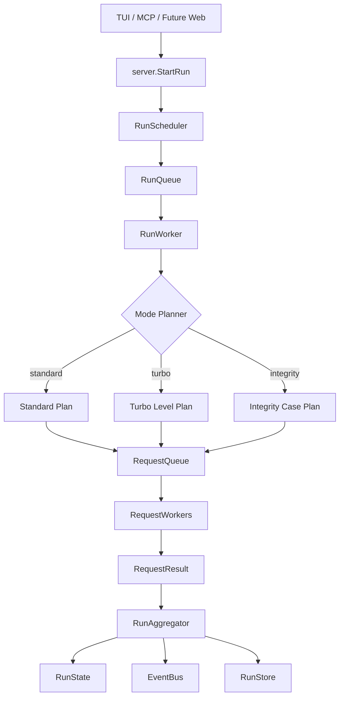
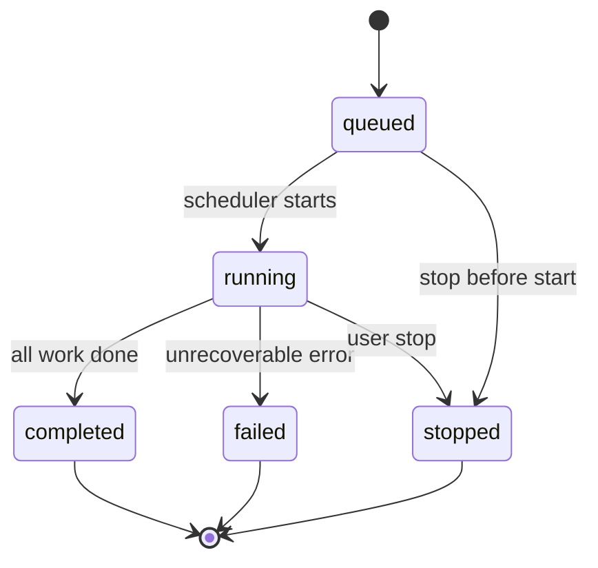
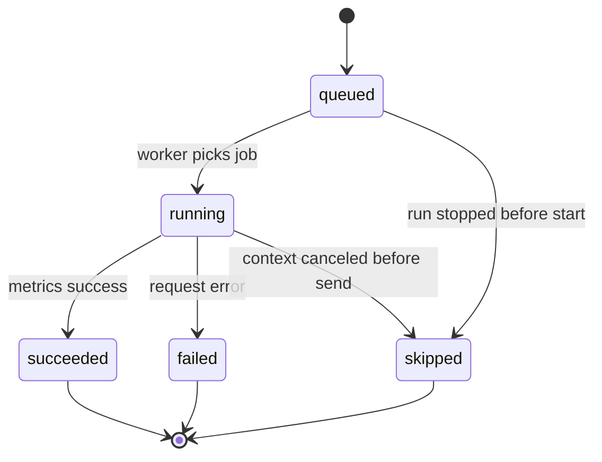

# 队列化执行架构设计

> 版本：v0.2 设计草案  
> 日期：2026-06-10

---

## 目录

1. [概述](#1-概述)
2. [设计目标与非目标](#2-设计目标与非目标)
3. [核心原则](#3-核心原则)
4. [总体架构](#4-总体架构)
5. [核心数据模型](#5-核心数据模型)
6. [运行队列设计](#6-运行队列设计)
7. [请求队列设计](#7-请求队列设计)
8. [事件模型](#8-事件模型)
9. [状态机](#9-状态机)
10. [取消、停止与超时](#10-取消停止与超时)
11. [持久化边界](#11-持久化边界)
12. [三种模式接入方式](#12-三种模式接入方式)
13. [Server API 影响](#13-server-api-影响)
14. [TUI / MCP 行为](#14-tui--mcp-行为)
15. [推荐实现结构](#15-推荐实现结构)
16. [迁移计划](#16-迁移计划)
17. [取舍与约束](#17-取舍与约束)

---

## 1. 概述

AIT 当前运行机制是：`StartRun(taskID)` 立即创建 `RunState`，然后在后台 goroutine 中直接执行对应模式。请求层由 `standard.Runner` 内部用 goroutine 和信号量限制并发。

下一版应改为两级队列模型：

1. **运行队列（Run Queue）**：任务的一次执行是一个 Run。`StartRun` 只负责提交 Run，Run 进入队列等待调度。
2. **请求队列（Request Queue）**：Run 内部的每个具体 HTTP 请求都是一个 Request Job。请求进入队列，由固定数量 worker 执行。

目标架构：

```text
TaskDefinition
  └── RunQueue
        └── RunWorker
              └── RequestQueue
                    ├── RequestWorker 1
                    ├── RequestWorker 2
                    └── RequestWorker N
```

其中：

- Task 是可复用配置。
- Run 是一次任务执行。
- Request Job 是一次实际请求。
- Event 是运行时状态变化通知。
- Store 只保存最终可回放的业务事实。

---

## 2. 设计目标与非目标

### 2.1 目标

1. **任务运行可排队**

   多个任务可以提交执行，但不必立即全部启动。Server 可以控制全局最大运行数，避免 TUI、MCP 或未来 Web UI 同时提交过多运行导致资源失控。

2. **请求执行可排队**

   每个 Run 内部的请求显式进入请求队列，由固定 worker 池执行。并发数由 worker 数表达，而不是每个请求直接创建 goroutine。

3. **状态可观测**

   Run 和 Request 都应有明确状态：queued、running、completed、failed、stopped、skipped。TUI 可以显示等待、执行、完成和停止。

4. **统一三种模式底层执行**

   standard、turbo、integrity 都应复用同一套请求队列和请求执行器。模式层只负责任务拆解、阶段推进和结果聚合。

5. **取消可传播**

   StopRun 应通过 `context.Context` 向运行和请求传播取消信号。未开始的请求应跳过，已开始的请求尽量中止。

6. **持久化仍以事实为准**

   队列事件和中间态用于实时 UI，不作为长期事实源。最终历史仍由 `run.json`、`requests.jsonl`、`result.json` 重建。

7. **兼容现有 Server 调用方**

   `StartRun(taskID) (RunID, error)` 可以保持不变，但语义从“立即启动”变为“提交运行”。

### 2.2 非目标

当前阶段不做以下事情：

- 不引入外部消息队列。
- 不做跨进程分布式调度。
- 不做优先级、定时任务和 cron。
- 不持久化未完成队列并在重启后自动恢复执行。
- 不为运行态建立数据库或索引系统。
- 不把 event bus 作为事实存储。

---

## 3. 核心原则

### 3.1 Server 拥有调度权

执行控制应集中在 `internal/server`。模式执行器不应该自己决定全局调度，也不应该直接维护全局 active runs。

### 3.2 模式层只描述计划

standard、turbo、integrity 不直接发散 goroutine。它们负责生成请求计划、消费请求结果、判断下一阶段是否继续。

### 3.3 请求执行器只执行单个请求

协议客户端和请求执行器只关心一次请求：构建 prompt、发 HTTP、收集指标、返回结果。

### 3.4 状态更新单线程聚合

一个 Run 内部应有唯一聚合器负责修改 `RunState`，避免多个 request worker 同时写复杂状态。worker 只把结果发送到 result channel。

### 3.5 事实存储与实时状态分离

- 实时状态：内存中的 `RunState`、`RequestState`、event bus。
- 持久事实：`requests.jsonl` 和最终 `run.json` / `result.json`。

---

## 4. 总体架构



模块职责：

| 模块 | 职责 |
|------|------|
| `RunScheduler` | 接收 Run 提交，控制全局最大并行 Run 数 |
| `RunQueue` | 保存等待执行的 Run |
| `RunWorker` | 取出 Run，按模式启动运行流程 |
| `Mode Planner` | 将模式拆解为一个或多个请求批次 |
| `RequestQueue` | 保存待执行请求 |
| `RequestWorker` | 执行单个请求，返回 `RequestResult` |
| `RunAggregator` | 顺序聚合请求结果，更新状态、写存储、发事件 |
| `EventBus` | 向 TUI/MCP 分发实时事件 |
| `RunStore` | 保存请求事实和最终结果 |

---

## 5. 核心数据模型

### 5.1 RunStatus

```go
type RunStatus string

const (
    RunStatusQueued    RunStatus = "queued"
    RunStatusRunning   RunStatus = "running"
    RunStatusCompleted RunStatus = "completed"
    RunStatusFailed    RunStatus = "failed"
    RunStatusStopped   RunStatus = "stopped"
)
```

### 5.2 RequestStatus

```go
type RequestStatus string

const (
    RequestStatusQueued    RequestStatus = "queued"
    RequestStatusRunning   RequestStatus = "running"
    RequestStatusSucceeded RequestStatus = "succeeded"
    RequestStatusFailed    RequestStatus = "failed"
    RequestStatusSkipped   RequestStatus = "skipped"
)
```

### 5.3 RunQueueItem

```go
type RunQueueItem struct {
    RunID     RunID
    TaskID    string
    TaskDef   types.TaskDefinition
    Input     types.Input
    Mode      string
    CreatedAt time.Time
}
```

`RunQueueItem` 是调度输入，不直接持久化。重启后未完成队列不自动恢复。

### 5.4 RequestJob

```go
type RequestJob struct {
    RunID    RunID
    TaskID   string
    Sequence int
    Input    types.Input
    Contexts RequestContexts
}
```

`Sequence` 是本次运行内全局递增序号，用于请求事实排序。

### 5.5 RequestContexts

```go
type RequestContexts struct {
    Standard *StandardRequestContext
    Turbo    *TurboRequestContext
    Integrity *IntegrityRequestContext
}
```

示例：

```go
type TurboRequestContext struct {
    LevelIndex     int
    Concurrency    int
    RequestInLevel int
}

type IntegrityRequestContext struct {
    CaseID     string
    CaseName   string
    Required   bool
    Assertions []types.Assertion
}
```

### 5.6 RequestState

```go
type RequestState struct {
    Sequence   int
    Status     RequestStatus
    Level      int
    StartedAt  *time.Time
    FinishedAt *time.Time
    Metrics    *types.RequestMetrics
    Error      string
    Contexts   RequestContexts
}
```

`RunState` 可以先保留现有 `Requests []*types.RequestMetrics`，再新增：

```go
RequestStates []*RequestState
QueuedReqs    int
RunningReqs   int
SkippedReqs   int
```

迁移完成后，TUI 应优先读取 `RequestStates`。

### 5.7 RequestResult

```go
type RequestResult struct {
    Job       RequestJob
    Metrics   *client.ResponseMetrics
    Err       error
    StartedAt time.Time
    FinishedAt time.Time
}
```

worker 不直接修改 `RunState`，只返回 `RequestResult`。

---

## 6. 运行队列设计

### 6.1 提交流程

`StartRun(taskID)` 的新语义：提交一次运行。

流程：

1. 读取任务。
2. hydrate input。
3. 应用全局 proxy。
4. 创建 `RunID`。
5. 创建 `activeRun`，状态为 `queued`。
6. 放入 `activeRuns`。
7. 向 `RunScheduler.Enqueue` 提交 `RunQueueItem`。
8. 发布 `EventRunQueued`。
9. 返回 `RunID`。

### 6.2 调度器

```go
type RunScheduler struct {
    queue      chan RunQueueItem
    maxRunning int
    semaphore  chan struct{}
    stopCh     chan struct{}
}
```

调度策略：

- 默认 FIFO。
- `maxRunning` 默认 1，避免多个压测任务互相干扰。
- 后续可从配置读取，例如 `config.max_parallel_runs`。
- 每个被调度的 Run 在独立 goroutine 中执行。
- Run 结束后释放 semaphore。

### 6.3 为什么默认 maxRunning=1

AIT 的指标包含 DNS、TCP、TLS、TTFT、TPS 等。多个 Run 同时执行会互相争抢本机网络、CPU 和目标服务资源，导致结果难以解释。

因此最佳默认实现是：

- **全局 Run 串行**。
- **Run 内请求按用户配置并发**。

如果用户明确需要并行任务，可以以后通过配置开启。

### 6.4 队列可见性

`GetRunState(runID)` 对 queued Run 返回：

- `Status = queued`
- `TotalReqs` 如果已知则填充。
- `DoneReqs = 0`
- `QueuedReqs = TotalReqs`。

`ListTasks()` 中 LatestRun 可以覆盖 queued/running 状态，便于任务列表显示。

---

## 7. 请求队列设计

### 7.1 Worker Pool

请求队列由 Run 内部创建，不跨 Run 共享。

```go
type RequestQueue struct {
    jobs    chan RequestJob
    results chan RequestResult
    workers int
}
```

worker 数等于本阶段并发数：

- standard：`input.Concurrency`
- turbo：当前 level 的 concurrency
- integrity：通常为 1

### 7.2 执行流程

```text
1. mode planner 生成 request jobs
2. aggregator 将 jobs 标记为 queued
3. request queue 启动 N 个 worker
4. worker 从 jobs 取任务
5. worker 标记 request running 事件
6. worker 执行请求
7. worker 发送 RequestResult
8. aggregator 顺序消费 result
9. aggregator 写 requests.jsonl，更新 RunState，发布事件
10. 所有 job 完成或 ctx 取消后关闭队列
```

### 7.3 单请求执行器

```go
type RequestExecutor interface {
    Execute(ctx context.Context, job RequestJob) (*client.ResponseMetrics, error)
}
```

默认实现：

```go
type modelRequestExecutor struct {
    client client.ModelClient
    upload *upload.Uploader
}
```

它负责：

- 根据 `PromptMode` 取 raw body 或 system/user prompt。
- 调用 `RawRequest` 或 `Request`。
- 上传匿名报告。
- 返回 `client.ResponseMetrics`。

### 7.4 聚合器

`RunAggregator` 是 Run 内唯一状态写入者：

```go
type RunAggregator struct {
    ar       *activeRun
    runStore *store.RunStore
    bus      *eventBus
}
```

职责：

- 初始化 `RequestState`。
- 处理 request queued/running/done。
- 将 `client.ResponseMetrics` 转换为 `types.RequestMetrics`。
- 追加写入 `requests.jsonl`。
- 更新计数和平均值。
- 发布事件。

---

## 8. 事件模型

新增事件类型：

```go
const (
    EventRunQueued      EventKind = "run_queued"
    EventRunStarted     EventKind = "run_started"
    EventRequestQueued  EventKind = "request_queued"
    EventRequestStarted EventKind = "request_started"
    EventRequestDone    EventKind = "request_done"
    EventProgressTick   EventKind = "progress_tick"
    EventRunComplete    EventKind = "run_complete"
    EventRunFailed      EventKind = "run_failed"
    EventRunStopped     EventKind = "run_stopped"
)
```

事件 payload 建议统一为 `*RunState`，减少 TUI 分支：

| 事件 | Payload |
|------|---------|
| `run_queued` | `*RunState` |
| `run_started` | `*RunState` |
| `request_queued` | `*RunState` |
| `request_started` | `*RunState` |
| `request_done` | `*RunState` |
| `progress_tick` | `*RunState` |
| `run_complete` | `*RunState` |
| `run_failed` | `*RunState` |
| `run_stopped` | `*RunState` |

Turbo 和 Integrity 的领域事件可以保留：

- `level_done`
- `integrity_case_started`
- `integrity_case_done`
- `assertion_result`

但它们不应替代请求事实记录。

---

## 9. 状态机

### 9.1 Run 状态机



规则：

- queued 状态可取消，取消后不会进入 request queue。
- running 状态停止时，未开始请求标记为 skipped，已开始请求尽量取消。
- completed、failed、stopped 是终态。

### 9.2 Request 状态机



---

## 10. 取消、停止与超时

### 10.1 context 传播

每个 active Run 应持有：

```go
type activeRun struct {
    mu     sync.RWMutex
    state  *RunState
    cancel context.CancelFunc
    runner modes.Runner
}
```

`StopRun(runID)`：

1. 如果 Run queued：从调度视角标记 stopped，发布事件。
2. 如果 Run running：调用 `cancel()`。
3. 兼容期内，如果 `runner != nil`，继续调用 `runner.Stop()`。

### 10.2 HTTP 请求取消

协议客户端应逐步改造为接受 context：

```go
Request(ctx context.Context, systemPrompt, userPrompt string, stream bool)
RawRequest(ctx context.Context, rawBody string)
```

迁移期可以先在队列层阻止新请求启动，已发出的请求仍等待完成；随后再改 HTTP 层。

### 10.3 超时

每个 `RequestJob` 执行时基于 `input.Timeout` 派生子 context：

```go
ctx, cancel := context.WithTimeout(runCtx, input.Timeout)
```

如果未配置 timeout，则使用 run context。

---

## 11. 持久化边界

### 11.1 不持久化队列本身

以下内容不持久化：

- RunQueue 中尚未开始的排队项。
- RequestQueue 中尚未执行的请求项。
- request queued/running 事件。
- progress_tick 事件。

原因：这些是运行时调度细节，不是业务事实。

### 11.2 持久化请求结果

请求只有进入终态且产生结果后，才写入 `requests.jsonl`。

- succeeded：写完整请求、响应、指标。
- failed：写错误摘要和已有 metrics。
- skipped：默认不写入 `requests.jsonl`，只在 `result.json` 中保存 planned/started/completed/skipped 统计。

### 11.3 result.json 补充非派生统计

如果运行被停止或失败，`result.json` 可保存：

```json
{
  "total_reqs": 100,
  "planned_reqs": 100,
  "started_reqs": 37,
  "skipped_reqs": 63,
  "error_summary": "stopped by user"
}
```

这些统计无法只从已完成请求稳定推导，因此允许保存。

---

## 12. 三种模式接入方式

### 12.1 Standard

standard 最简单：一次性生成 `input.Count` 个 RequestJob。

```text
build jobs 0..Count-1
run request queue with input.Concurrency workers
aggregate all results
build ReportData
complete run
```

standard 不再需要在 `Runner` 内部创建每请求 goroutine。最佳实现是删除 `standard.Runner` 的并发调度职责，只保留请求计划或单请求执行辅助。

### 12.2 Turbo

Turbo 是多阶段请求队列：

```text
for each level:
  build level jobs
  run request queue with level concurrency workers
  aggregate level result
  publish level_done
  evaluate stop condition
```

Turbo 的 level 之间仍串行，level 内请求并发。

优点：

- 当前 level 的请求事实自然带有 `contexts.turbo`。
- 停止条件由 level 聚合结果决定。
- 手动停止可以在 level 中途生效。

### 12.3 Integrity

Integrity 是 case 队列：

```text
for each case:
  publish case_started
  build one RequestJob
  run request queue with 1 worker
  evaluate assertions from RequestResult
  publish assertion_result
  publish case_done
  fail_fast if needed
```

Integrity 的断言不应在 request worker 内执行。worker 只负责请求，case executor / aggregator 负责断言。

---

## 13. Server API 影响

### 13.1 保持兼容

现有接口可以保持：

```go
StartRun(taskID string) (RunID, error)
StopRun(runID RunID) error
GetRunState(runID RunID) (*RunState, bool)
SubscribeRunEvents(runID RunID) (<-chan Event, CancelFunc)
```

语义变化：

- `StartRun`：从“立即启动”改为“提交执行”。
- `StopRun`：可停止 queued 或 running Run。
- `GetRunState`：可返回 queued 状态。

### 13.2 后续可选 API

后续如果需要队列管理，可以新增：

```go
ListRunQueue() ([]RunQueueEntry, error)
MoveQueuedRun(runID RunID, position int) error
CancelQueuedRun(runID RunID) error
```

首版不需要。

---

## 14. TUI / MCP 行为

### 14.1 TUI

任务列表：

- queued：显示 `○ queued` 或 `⏳ waiting`。
- running：显示 `◉ running`。
- terminal：显示最近历史摘要。

运行仪表盘：

- queued Run 打开仪表盘时显示“等待调度”。
- running 后自动更新为请求进度。
- 请求列表可以显示 queued/running/done/skipped。

### 14.2 MCP

`ait.run_task` 返回 `run_id` 后，不保证任务已开始，只保证已提交。

`ait.get_task_state` 应返回：

- run status。
- queue position，如果可得。
- progress counters。

---

## 15. 推荐实现结构

推荐新增文件：

```text
internal/server/
  scheduler.go          ← RunScheduler
  request_queue.go      ← RequestQueue / RequestJob / RequestResult
  request_executor.go   ← 单请求执行器
  run_aggregator.go     ← RunState 聚合与事件发布
```

推荐逐步瘦身：

```text
internal/server/modes/standard/runner.go
```

最终应从“并发请求执行器”变为“标准模式计划/结果构建辅助”，不再拥有全局调度。

### 15.1 activeRun 建议结构

```go
type activeRun struct {
    mu      sync.RWMutex
    state   *RunState
    cancel  context.CancelFunc
    runner  modes.Runner

    tpsSum    float64
    ttftSum   time.Duration
    cacheSum  float64
    tokenSum  int64
}
```

### 15.2 serverImpl 建议结构

```go
type serverImpl struct {
    mu         sync.RWMutex
    taskStore  *store.TaskStore
    taskViews  *store.TaskViewStore
    runStore   *store.RunStore
    bus        *eventBus
    activeRuns map[RunID]*activeRun
    scheduler  *RunScheduler
}
```

`activeRuns` 包含 queued 和 running，直到终态持久化成功后移除。

---

## 16. 迁移计划

### 阶段 1：RunStatus queued 与 RunScheduler

- 新增 `RunStatusQueued`。
- `StartRun` 改为 enqueue。
- 新增 `RunScheduler`，默认 `maxRunning=1`。
- 保持现有 `runStandard/runTurbo/runIntegrity` 不变。

收益：先解决任务级队列。

### 阶段 2：standard 请求队列

- 在 `standard.Runner.RunWithCallback` 内部改为 job queue + worker pool。
- 外部接口不变。
- 保持现有测试尽量不变。

收益：先消除 goroutine fan-out，建立请求级队列基础。

### 阶段 3：Server 统一 RequestQueue

- 新增 `RequestJob`、`RequestResult`、`RequestExecutor`。
- 将 standard 请求执行上移到 Server。
- `standard.Runner` 只保留结果计算或迁移为 helper。

收益：Server 能观测 request queued/running。

### 阶段 4：Turbo / Integrity 接入统一 RequestQueue

- Turbo 每个 level 用 RequestQueue。
- Integrity 每个 case 用 RequestQueue。
- 去掉模式内部对 `standard.Runner` 的强依赖。

收益：三种模式底层执行完全统一。

### 阶段 5：context 化 HTTP Client

- `ModelClient` 方法增加 context。
- `StopRun` 能中断已发出的 HTTP 请求。

收益：停止语义完整。

---

## 17. 取舍与约束

### 17.1 为什么不使用外部队列

AIT 是本地 CLI/TUI 工具，引入 Redis、SQLite job queue 或其他外部组件会增加安装和运维成本。当前最佳选择是进程内 channel + context。

### 17.2 为什么默认 Run 串行

性能测试结果需要可解释性。多个 Run 同时执行会导致指标互相污染。默认串行更符合工具定位。

### 17.3 为什么不持久化 queued/running

运行中队列恢复涉及 HTTP 幂等、请求重放、半完成状态和用户预期，复杂度高。首版只保证最终事实可回放。

### 17.4 为什么 Request worker 不直接写状态

多个 worker 并发写 `RunState` 容易造成锁粒度复杂、事件乱序和状态不一致。统一 aggregator 写状态更简单可靠。

---

## 结论

最佳实现应采用：

```text
RunQueue 默认串行调度 + Run 内 RequestQueue worker pool + 单聚合器更新状态
```

这能在不引入外部依赖的前提下，让任务和请求都成为显式队列，提升可控性、可观测性和后续扩展能力。
